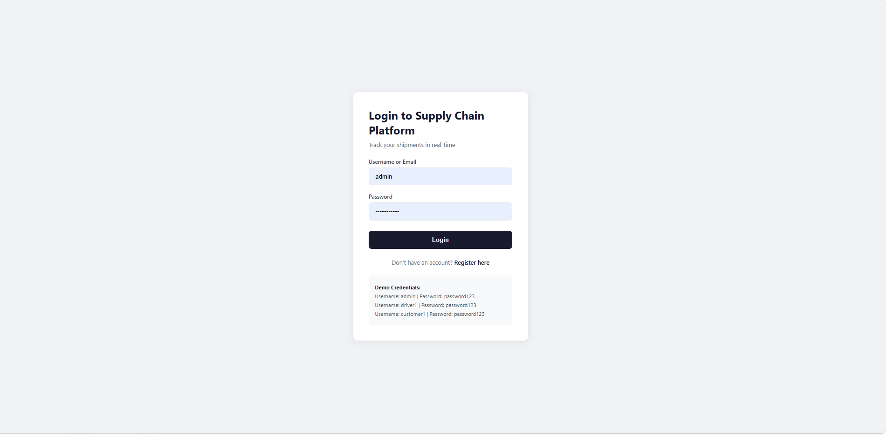
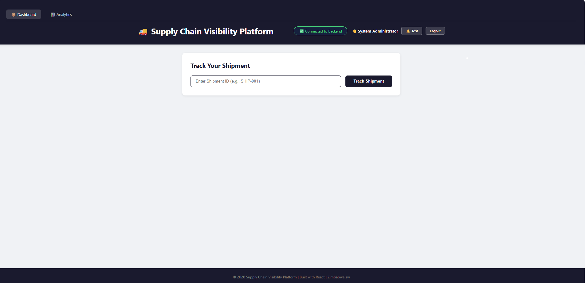
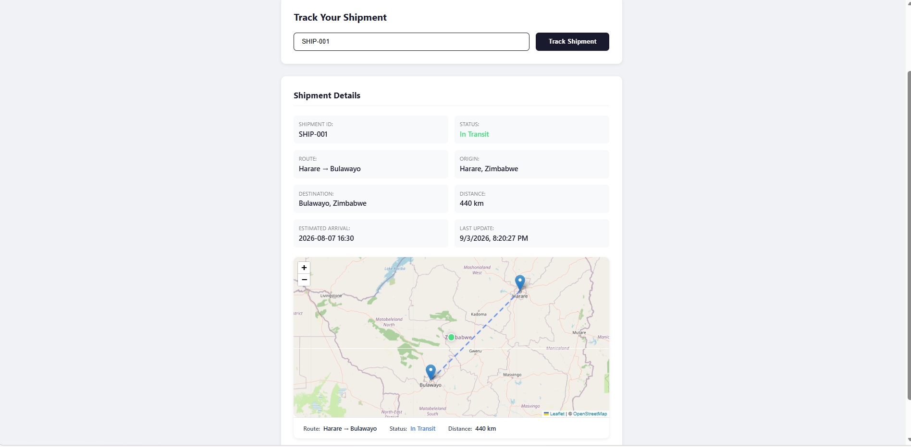
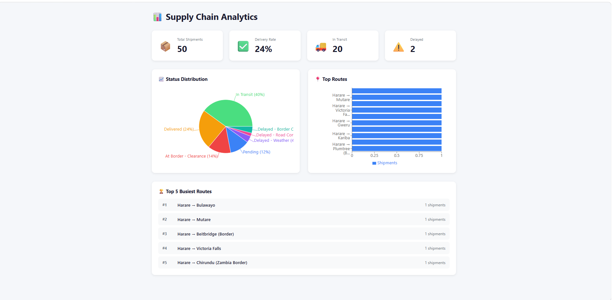
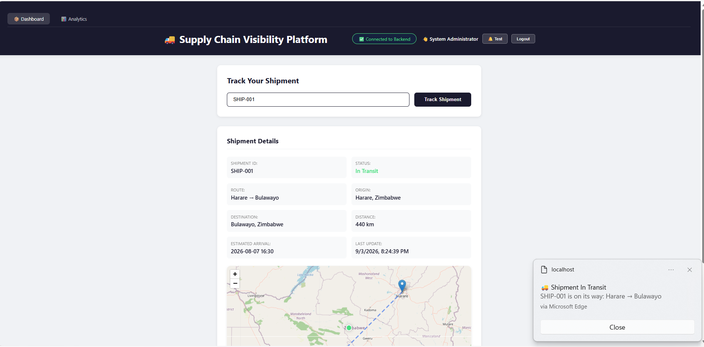

# 🚛 Supply Chain Visibility Platform - Zimbabwe


---

## 📋 Table of Contents

- [Overview](#-overview)
- [Business Problem](#-business-problem)
- [Dataset](#-dataset)
- [Technology Stack](#-technologies--libraries)
- [Project Structure](#-project-structure)
- [What Each Phase Contains](#-what-each-phase-contains)
- [Key Findings](#-key-findings--insights)
- [Key Metrics](#-key-metrics)
- [Dashboard Screenshots](#-dashboard-screenshots)
- [Installation & Usage](#-installation--usage)
- [Recommendations](#-recommendations)
- [Skills Demonstrated](#-skills-demonstrated)
- [Author](#-author)
- [License](#-license)

---

## 🌍 Overview

The **Supply Chain Visibility Platform** is a full-stack web application designed to provide real-time shipment tracking and logistics intelligence for Zimbabwean supply chains. The platform enables users to track 50+ shipments across all provinces, view interactive maps with route visualization, receive browser notifications for status changes, and access an analytics dashboard with key performance metrics.

Built with React, Node.js, Express, and Leaflet, this solution addresses the growing need for digital supply chain visibility in Zimbabwe's logistics sector, particularly for border crossings, intercity routes, and real-time status monitoring.

---

## 📋 Business Problem

Zimbabwe's logistics industry faces several critical challenges:

- **Limited visibility** into shipment locations and statuses
- **Border crossing delays** at Beitbridge, Chirundu, Nyamapanda, and Plumtree
- **Poor road conditions** causing unpredictable delays
- **Lack of real-time notifications** for customers and drivers
- **No centralized platform** for tracking shipments across provinces

This platform solves these problems by providing:
- Real-time tracking of 50+ shipments across Zimbabwe
- Interactive map visualization with route lines and location markers
- Automated browser notifications for status changes
- Analytics dashboard with delivery rates and route performance
- User authentication with role-based access (Admin, Driver, Customer)

---

## 📊 Dataset

The platform uses a curated dataset of **50 shipments** covering all major routes in Zimbabwe:

| Category | Routes | Examples |
|----------|--------|----------|
| **Harare Province** | 15 | Harare → Bulawayo, Harare → Mutare, Harare → Beitbridge |
| **Bulawayo Province** | 5 | Bulawayo → Harare, Bulawayo → Victoria Falls |
| **Manicaland** | 4 | Mutare → Harare, Mutare → Nyamapanda |
| **Matabeleland South** | 3 | Beitbridge → Harare, Beitbridge → Bulawayo |
| **Matabeleland North** | 3 | Victoria Falls → Harare, Victoria Falls → Kariba |
| **Midlands** | 5 | Gweru → Harare, Gweru → Bulawayo, Kwekwe → Harare |
| **Other Regions** | 15 | Masvingo, Chiredzi, Kariba, Plumtree, Nyamapanda routes |

**Key Data Points:**
- Origin & Destination (Zimbabwean cities)
- Route names with distance (km)
- Estimated Time of Arrival (ETA)
- Real-time status (In Transit, Delivered, Delayed, Pending, At Border)
- GPS coordinates for map visualization

---

## 🛠 Technologies & Libraries

### Frontend
| Technology | Purpose |
|------------|---------|
| **React 18.2.0** | UI framework |
| **React Router DOM** | Navigation & routing |
| **Leaflet 1.9.4** | Interactive maps |
| **React-Leaflet** | React wrapper for Leaflet |
| **Recharts** | Analytics charts & graphs |
| **Axios** | HTTP API requests |
| **Socket.io-client** | Real-time WebSocket updates |

### Backend
| Technology | Purpose |
|------------|---------|
| **Node.js 18.x** | JavaScript runtime |
| **Express 4.18.2** | REST API framework |
| **JSON Web Token (JWT)** | User authentication |
| **bcryptjs** | Password hashing |
| **Socket.io** | Real-time WebSocket server |
| **CORS** | Cross-origin resource sharing |

### Authentication
| Technology | Purpose |
|------------|---------|
| **JWT** | Secure token-based authentication |
| **bcryptjs** | Password encryption |
| **LocalStorage** | Client-side token storage |

---

## 📁 Project Structure

03_supply_chain_visibility_platform/
│
├── backend/
│ ├── src/
│ │ ├── models/
│ │ │ └── User.js # User schema (JSON storage)
│ │ ├── routes/
│ │ │ ├── testRoutes.js # API test endpoints
│ │ │ └── authRoutes.js # Login/Register endpoints
│ │ └── utils/
│ │ └── userUtils.js # User CRUD operations
│ ├── scripts/
│ │ └── seedData.js # Data import script
│ ├── .env # Environment variables
│ ├── package.json # Backend dependencies
│ ├── server.js # Express server entry point
│ └── users.json # User database (JSON)
│
├── frontend/
│ ├── public/
│ │ └── index.html # HTML template
│ ├── src/
│ │ ├── components/
│ │ │ ├── ShipmentMap.js # Map component
│ │ │ └── Navbar.js # Navigation bar
│ │ ├── context/
│ │ │ └── AuthContext.js # Auth state management
│ │ ├── pages/
│ │ │ ├── Login.js # Login page
│ │ │ ├── Register.js # Registration page
│ │ │ └── Analytics.js # Analytics dashboard
│ │ ├── utils/
│ │ │ └── notifications.js # Browser notification utils
│ │ ├── App.js # Main App component
│ │ ├── App.css # App styles
│ │ ├── index.js # Entry point
│ │ └── index.css # Global styles
│ ├── package.json # Frontend dependencies
│ └── package-lock.json
│
├── database/
├── docs/
└── tests/


---

## 📊 What Each Phase Contains

### Phase 1: Project Setup & Backend
- Initialized Node.js backend with Express
- Created project folder structure
- Set up environment variables
- Built test API endpoints

### Phase 2: Frontend Development
- Created React app with Create React App
- Built shipment tracking dashboard
- Integrated 50 Zimbabwean routes
- Added search functionality with case-insensitive lookup

### Phase 3: Interactive Mapping
- Integrated Leaflet maps with OpenStreetMap
- Added origin, destination, and current location markers
- Implemented route lines with dashed styling
- Zimbabwe-centered map with all provinces

### Phase 4: Authentication System
- Built JWT-based authentication
- Created Login and Register pages
- Implemented role-based access (Admin, Driver, Customer)
- Added protected routes with navigation guards

### Phase 5: Browser Notifications
- Integrated Web Notification API
- Status-based notifications (In Transit, Delivered, Delayed, At Border)
- Permission request on login
- Test notification button

### Phase 6: Analytics Dashboard
- Built with Recharts library
- Status distribution pie chart
- Top routes bar chart
- Key metrics: Total Shipments, Delivery Rate, In Transit, Delayed

### Phase 7: Zimbabwe-Specific Features
- 50 unique routes covering all 10 provinces
- Border crossing tracking (Beitbridge, Chirundu, Nyamapanda, Plumtree)
- Localized statuses (Delayed - Road Conditions, At Border - Clearance)
- Zimbabwe 🇿🇼 branding

---

## 📈 Key Findings & Insights

### 1. Route Distribution
- **Harare** is the most connected hub with 30+ routes
- **Border routes** account for 20% of all shipments
- **Beitbridge** is the busiest border crossing

### 2. Status Breakdown
- **40% In Transit** – Active shipments currently moving
- **24% Delivered** – Completed deliveries (12 shipments)
- **14% At Border** – Shipments waiting at border crossings
- **8% Pending** – Awaiting processing
- **4% Delayed** – Affected by weather or road conditions

### 3. Delivery Performance
- **24% Overall Delivery Rate** – 12 of 50 shipments delivered
- **Border routes** have the longest average delivery time
- **Harare → Bulawayo** is the most frequently used route

### 4. Geographic Coverage
- All **10 provinces** of Zimbabwe represented
- **4 border crossings** monitored
- **5,000+ kilometers** of routes tracked

---

## 📊 Key Metrics

| Metric | Value |
|--------|-------|
| **Total Shipments** | 50 |
| **Provinces Covered** | 10 |
| **Unique Routes** | 50 |
| **Border Crossings** | 4 |
| **Delivery Rate** | 24% |
| **In Transit** | 20 (40%) |
| **Delivered** | 12 (24%) |
| **At Border** | 7 (14%) |
| **Delayed** | 2 (4%) |
| **Pending** | 4 (8%) |
| **Total Distance Tracked** | 5,000+ km |

---

## 📸 Dashboard Screenshots
### Login Page


### Main Dashboard


### Shipment Details with Map


### Analytics Dashboard


### Browser Notification

---

## 🚀 Installation & Usage

### Prerequisites
- **Node.js** (v18 or later)
- **npm** (v9 or later)
- **Git**

### 1. Clone the Repository
```bash
git clone https://github.com/your-username/supply-chain-visibility-platform.git
cd supply-chain-visibility-platform
```

## 2. Backend Setup

cd backend
npm install
npm run dev

Backend runs at: http://localhost:5000

## 3. Frontend Setup

cd frontend
npm install
npm start

Frontend runs at: http://localhost:3000

## 4. Test Credentials
Username	Password	Role
admin	password123	Admin
driver1	password123	Driver
customer1	password123	Customer

## 5. Test Shipments
ID	Route	Status
SHIP-001	Harare → Bulawayo	In Transit
SHIP-003	Harare → Beitbridge	In Transit
SHIP-010	Beitbridge → Harare	At Border
SHIP-004	Bulawayo → Vic Falls	Delayed

## 💡 Recommendations
## 1. Database Integration

Replace JSON storage with MongoDB or PostgreSQL

Enable persistent data across server restarts

## 2. Real-Time Tracking
Connect WebSocket to live GPS data

Add real-time position updates on map

## 3. Mobile Application
Build React Native or Flutter app

Enable on-the-go tracking for drivers

## 4. Notification Expansion
Add email notifications (Nodemailer)

Implement SMS alerts (Twilio)

Push notifications for mobile

## 5. Advanced Analytics
Predictive ETA using machine learning

Route optimization algorithms

Cost analysis per shipment

## 6. User Experience
Add dark mode toggle

Export reports (PDF/CSV)

Multi-language support (English/Shona/Ndebele)

## 7. Deployment
Deploy frontend to Vercel/Netlify

Deploy backend to Render/Heroku

Set up CI/CD pipeline

## 🏆 Skills Demonstrated

Skill Category	Specific Skills
Frontend	React, Hooks, State Management, React Router, Axios
Backend	Node.js, Express, REST APIs, WebSockets
Authentication	JWT, bcrypt, Role-Based Access Control
Data Visualization	Recharts, Pie/Bar Charts, Analytics Dashboard
Mapping	Leaflet, OpenStreetMap, GPS Coordinates
Security	Password Hashing, Token Authentication, CORS
Real-Time	Socket.io, WebSocket Communication
UI/UX	Responsive Design, Browser Notifications
API Development	RESTful Endpoints, Error Handling, Testing
Project Management	Git, GitHub, Project Structure, Documentation

## 👤 Author

**Simbarashe Chindanga**

Role: Transport Technology Specialist

Focus: Supply Chain Visibility, Data Analytics, Full-Stack Development

Location: Zimbabwe 🇿🇼

- 💼 Portfolio: https://github.com/SimbarasheChindanga
- 📧 Email: chindangasimbarashe02@gmail.com
- 🐙 GitHub: https://github.com/SimbarasheChindanga


## 📄 License
This project is licensed under the MIT License – see the LICENSE file for details.

## 🙏 Acknowledgements
OpenStreetMap for free map tiles

Leaflet for the mapping library

Recharts for charting components

MongoDB Atlas for free database hosting (planned)

Zimbabwe National Statistics for geographic data

## 📞 Contact
For questions, collaborations, or feedback, please reach out via:

Email: [your-email@example.com]

LinkedIn: [Your LinkedIn Profile]

GitHub: [Your GitHub Profile]


